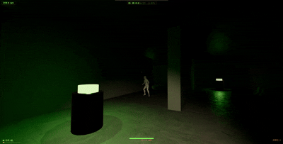
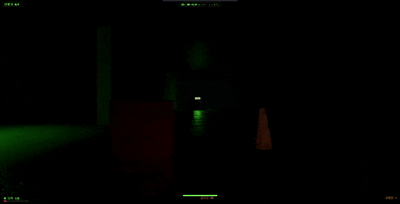

# HALF-LIGHT — 컴퓨터그래픽스 최종 과제 리포트

> 방사능 폐허에서 **간접광(Global Illumination)** 을 게임 메커니즘으로 사용하는 1인칭 잠행(스텔스) 게임.  
> 빛이 강한 곳은 잘 보이지만 좀비에게 노출되고, 어둠은 안전하지만 앞이 보이지 않음.

- **플레이(웹):** https://hhjae1.github.io/half-light/
- **소스 코드:** https://github.com/hhjae1/half-light
- **사용 기술:** Three.js (WebGL), Vite, GitHub Pages
- **GI 기법:** DDGI(Dynamic Diffuse Global Illumination) 방식 — probe 격자 + 멀티바운스

> ⚠️ 첫 접속 시 좀비/소품 3D 모델 로딩에 수 초 걸릴 수 있음. "GI 베이킹 중" 화면이 사라지면 화면을 클릭해 시작하면 됨.

---

## 1. 기획 (Game Design)

### 1.1 컨셉

방사능으로 폐허가 된 시설. 유일한 빛은 곳곳의 **방사능 단말기**에서 새어 나오는 초록빛뿐이고, 손전등으로 비춰 앞을 볼 수도 있음.  
단, 손전등을 사용할 경우 좀비에게 걸릴 가능성이 증가함.   
이 게임의 핵심 발상은 **"빛 = 정보이자 위험, 어둠 = 안전이자 무지"** 라는 딜레마를 *조명 기법 자체*로 구현함.
- 밝은 곳에 있으면 길이 보이지만, 그만큼 **좀비의 시야에 잘 띔(노출도↑).**
- 어둠 속에 있으면 안전하지만, **앞이 안 보여** 길을 잃거나 좀비를 못 봄.
- 즉, 화면을 밝히는 **간접광(GI)** 이 단순한 그래픽 효과가 아니라 **게임 재미를 위한 요소**로 설계함.

- 타이틀 화면. 초록빛 비네팅과 스캔라인으로 방사능 시설의 분위기를 표현함.   
- 게임 시작화면 하단에 조작키 안내가 있음.(WASD 조작, Shift 달리기, ctrl/c 앉기, Space 점프, Alt(누른상태로 마우스 전환) 둘러보기, F 손전등 on/off, E 단말기 활성화, Q 조명탄)

### 1.2 핵심 메커니즘 — 빛과 그림자의 딜레마

- **목표:** 흩어진 **단말기 5개를 모두 활성화** → 출구 개방 → 탈출
- **위협 1 (좀비):** 시야(FOV)·소리(발소리, 단말기 켜는 소리)·빛으로 플레이어를 감지, 접촉 시 사망
- **위협 2 (방사능):** 시간에 따라 피폭이 누적, 100% 도달 시 사망 → 사실상 제한시간
- **자원:** 손전등(시야 확보 ↔ 노출 증가), 조명탄(미끼), 스태미나(달리기), 앉기/점프

단말기의 빛은 어둠 속 유일한 길잡이지만, 동시에 플레이어를 비춰 **노출도**(좀비에게 노출될 확률을 올린다는 것)를 올림.  
-> 게임 화면 아래 감지도는 좀비에게 발각되었다라는 사실을 알려주는 용도. 빛 근처에 있는다고 감지도가 올라가지는 않음.

위 화면 **하단 중앙의 게이지가 감지도**. 좀비가 시야·소리로 플레이어를 **실제로 인지했을 때** 차오르며(가득 차면 추격 시작), 단순히 밝은 곳에 있다고 오르지는 않음.

### 1.3 승패 화면
| 탈출 성공 | 발각 사망 | 피폭 사망 |
|---|---|---|
|  |  |  |

단말기 5개를 모두 켜고 출구로 빠져나오면 "탈출 성공"(초록), 좀비에게 잡히면 "발각됨"(붉은 화면 + 좀비 실루엣), 피폭 100%면 "치사량 피폭"으로 게임오버.

---

## 2. 변환과 그래픽스 파이프라인 (L1, L2, L3)

### 2.1 카메라 / View·Projection Transform
강의에서 배웠던 렌더링 변환 파이프라인 **Model→World→View→Projection→Screen** 을 그대로 사용함.(각 물체가 있고 그 물체들이 world에 배치되어야 함.)  
그 중 우리가 시각적으로 봤을 때 파이프라인이 적용되었다라는 것을 보여주는 장면이 아래임. 그 이유는 아래 장면이 투영 변환의 결과를 보여주기 때문  
-> 멀리 있는 복도와 단말기가 거리에 따라 크고 작게 보이는 것이 투영 변환의 결과임.

### 2.2 Scene Graph / World Transform
좀비·단말기·소품·벽이 각자 **위치(Location)·회전(Rotation)·스케일(Scaling)** 을 가진 노드로 씬 그래프에 배치됨.
아래 화면에서 드럼통·도로·벽·단말기 등이 각각 다른 World 변환으로 한 공간(맵 전체)에 놓여 있음.

### 2.3 자유 시점 (View Transform 응용)
`Alt` 키를 누르면 **이동 방향은 고정한 채 카메라(뷰 시점)만 회전**(ex: 배틀그라운드에서 둘러보기와 비슷).  
→ 이동 기준 벡터와 시선 벡터를 분리해, 카메라 View 변환을 이동 로직과 독립적으로 처리함. 아래 gif 참조.

---

## 3. Lighting과 Shading (L4)

### 3.1 직접광 — PBR / emissive / 그림자
강의에서 배운 렌더링 방정식과 빛의 구성요소(ambient·diffuse·specular), 광원 종류, emissive material 개념을 적용하였지만,  
강의에서의 Phong lighting을 사용하지 않고, PBR(Physically Based Rendering)을 사용함.  
-> 더 현실적으로 보이게 하기 위해 PBR을 통해 diffuse·specular를 물리 기반으로 계산함. 단, Shading은 Three.js 기본 per-fragment를 사용하여 사실상 Phong Shading을 사용하였음.

방사능 단말기는 **emissive(자체 발광) 재질 + PointLight** 로 빛의 근원이 되고, 그 빛이 바닥에 원형 풀과 그림자를 만듦.

금속 드럼통 표면의 하이라이트와 반사 — PBR `MeshStandardMaterial`의 metalness/roughness로 표현(환경맵은 4.3).

### 3.2 ★ Global Illumination — DDGI (probe GI) ★ — 본 과제의 핵심 기법
직접광만으로 구현을 한다면 빛이 직접 닿는 곳만 보이고 그 외에는 새까맣게 보일 것임.  
**간접광(바운스 라이트)** 을 더해야 단말기의 초록빛이 벽·바닥·천장에 **번지고(color bleeding)** 그늘이 은은하게 보임.

#### GI ON / OFF 비교 (같은 위치)
| GI ON | GI OFF |
|---|---|
|  |  |

게임 내 `G` 키로 즉시 토글한 **같은 지점**의 시점을 보여줌(상단 HUD에 `GI: ON` / `GI: OFF` 표기).
- **GI ON:** 단말기의 초록빛이 왼쪽 벽과 바닥, 멀리 복도 벽까지 **간접적으로 번져** 공간 전체가 은은하게 드러남.
- **GI OFF:** 단말기 바로 아래 직접광 풀만 남고, 빛이 직접 닿지 않는 벽·바닥은 **새까맣게** 보임. 즉, 색 번짐이 사라짐.

또한 `[,]` 키로 **GI 세기(밝기)** 를 실시간 조절 가능 — 아래는 세기를 올릴수록 간접광이 강해지는 모습:

#### 구현 방식 (DDGI)

WebGL에는 하드웨어 raytracing이 없어, 원본 DDGI의 절차를 **rasterization으로 치환**해 구현함.
- **probe 격자(7×2×7)** 를 공간에 고르게 배치 — DDGI의 *"fixed 3D probe grid"*.
- 각 probe에서 **`CubeCamera`로 6면을 raster capture** → 방향별 입사 radiance(ambient-cube)로 저장.
  → 원본 DDGI의 *"각 probe에서 ray 발사"* 를 **6면 cube render로 대체**(raytracing 불필요).
- **multi-bounce (3 passes):** 이전 pass의 결과를 다음 pass 입력으로 다시 줘서 근사(recursive feedback). -> 강의에서 배운 내용과 같이 recursive로. 단, 여기서는 3 pass만 함.
- Pixel Shader(`onBeforeCompile` 주입)에서 **인접 8개 probe를 Tri-linear blending** → 표면 법선 방향의 irradiance를 `indirectDiffuse`에 합산.
- 동일한 probe 데이터를 CPU에서도 샘플링해 "현재 위치의 밝기"를 구하고, 이를 좀비의 시야 거리(sightRange) 계산에 사용함 → 밝은 곳일수록 더 멀리서 발각됨. (실제 발각 여부는 별도의 감지도 로 표시)
- *자세한 기술 노트: `docs/design-notes.md`*

-> 즉, 정리하자면 WebGL에서는 하드웨어 raytracing이 없어 우리가 강의에서 배운 DDGI를 그대로 적용하기 어려워 DDGI를 근사하는 방식으로 구현하였음.

---

## 4. Texture (L5)

### 4.1 Texture 매핑 — albedo / normal / roughness (PBR)
강의에서 배운 **Texture Mapping·UV·Normal map·Roughness** 를 적용함.
벽은 갈라진 석고/콘크리트, 바닥은 콘크리트로 **albedo + normal map + roughness map**(ambientCG, CC0)을 입혀 PBR 음영을 냄.  
`RepeatWrapping` 타일링과 'Anisotropic filtering'으로 넓은 면에서도 디테일이 유지됨.

손전등을 가까이 비춘 벽 — normal map 덕분에 평평한 면이 **요철처럼 음영**짐. (좌우 벽이 붉은/노란 색조인 것은 GI color bleeding(색 번짐)을 강조하기 위해 다르게 한 것)

### 4.2 외부 3D 모델 + Texture (정적 소품)
Poly Haven(CC0)의 **텍스처가 입혀진 glTF 소품**(드럼통·공구함·도로 바리어·콘크리트 잔해 등)을 로드하고, 각 소품에 **AABB(Axis-Aligned Bounding Box) 충돌**을 부여함.  

-> 각 벽·소품을 **축에 정렬된 직육면체(AABB)** 로 감싸고, 플레이어(반지름 `r`)와 겹치는지 검사해 이동을 막음. 물리 엔진 없이 가볍게 구현.  

-> 맵이 직각 구조(벽·상자·드럼통)라 박스 근사로 충분하고, BVH·물리엔진보다 **계산이 가벼워** 웹에서 매 프레임 부담이 없어 사용함.

| 도로 바리어 | 콘크리트 잔해(엄폐물 겸 점프 발판) |
|---|---|
|  |  |

### 4.3 환경맵 (Environment Map / Reflection)

금속 드럼통 등 매끈한 금속 재질에 **equirectangular 환경맵(PMREM)** 을 적용해 주변광 반사를 표현함.

---

## 5. Skeleton과 Animation (L6)

### 5.1 Skinned Mesh + Skeleton Animation
**Skeleton·Joint/Bone·Skinned Mesh·FK·Animation** 을 적용함.
Mixamo 좀비(스킨드 메쉬)를 **FBX로 로드**하고 `AnimationMixer`로 **Idle/Walk/Run/Turn/Scream/Agonize** 클립을 재생하였음.
두 좀비는 외형이 다르지만 **공용 Mixamo 스켈레톤**을 공유하므로 같은 애니메이션 클립을 호환해 사용함.

서로 다른 외형의 좀비:

좀비 걷는 모션:  

### 5.2 상태 기반 애니메이션 전환 / 리액션
AI 상태(**배회 → 수색 → 추격**)에 따라 애니메이션이 전환됨. 추가로 이벤트성 **리액션**을 `LoopOnce` 로 재생 후 원래 상태로 복귀함:
- 플레이어를 **처음 발각**하면 비명(**Scream**)을 지른 뒤 → 달려와 추격(**Run**), 잡히면 게임오버
- **조명탄**(미끼)을 인지하면 괴로워하는 모션(**Agonize**)으로 그 자리에 묶임
- 방향 전환 시 **Turn** 모션으로 부드럽게 회전(`TURN_SPEED` 보간)

조명탄을 던지면 좀비가 그쪽으로 다가가 **괴로워하는(Agonize) 리액션**을 재생하며 제자리에 서 있음(단, 뛰거나 손전등으로 불을 비추면 반응해서 쫓아옴):

---

## 6. 게임 메커니즘 상세 (완성도)

### 6.1 감지(Stealth) 시스템
좀비 감지는 **시야각(FOV) + 거리 + 가시선(LOS 레이캐스트) + 소리(자세별 청취 거리) + 손전등 빔** 을 종합.
- **노출도(밝기)** 가 높을수록 더 멀리서 보임: `sightRange = SIGHT_MIN + (SIGHT_MAX−SIGHT_MIN)·(노출/100)`.
- 벽에 가리면 시야는 차단(LOS)되지만 **소리는 벽 너머로도** 전달됨.
- HUD의 *감지도* 는 실제 좀비가 플레이어를 인지한 정도(awareness)를 표시.

단말기 빛 주변을 배회하는 좀비(감지 전):  

### 6.2 길찾기 AI (A*)
- 좀비는 점유 격자 위에서 **A\* 길찾기**(octile heuristic)로 벽/장애물을 우회함.  
- 2마리가 **동시에** 플레이어를 감지하면 좌우로 갈라져 **협공(flanking)** 하고, 경로가 벽 뒤로 빠지지 않도록 `nav.isFree` + LOS로 검증.  
- 좀비들이 서로 너무 가까워지면 살짝 밀어내, 한 몸처럼 포개지는 걸 막음.(좀비끼리의 충돌 대처)

두 좀비 협공:  
  
추격 중인 좀비의 경로 추적:  

### 6.3 조명탄 (미끼)
`Q` 로 **조명탄**을 던지면, 바닥에서 빛나는 조명탄이 주변 좀비를 **유인**함. 좀비는 그쪽으로 다가가 괴로워하며(Agonize) 그 자리에 묶이고, 그 틈에 플레이어는 잠입함.

### 6.4 목표 — 단말기 활성화
`E` 로 단말기를 활성화. 활성화 순간 **큰 소리**가 나 주변 좀비를 유인하는 리스크가 있음. 5개를 모두 켜면 출구가 열림.

| 활성화 전 ([E] 안내) | 활성화 후 (청록으로 전환) |
|---|---|
|  |  |

활성화되면 단말기 상단 발광색이 **초록 → 청록**으로 바뀌고 목표 카운터가 증가함.

### 6.5 레벨 디자인 — 미로 + 특수 통로 (플레이어 전용 지름길)
맵은 미로형이며, **플레이어만 통과할 수 있는 지름길**이 두 종류가 있음(좀비는 못 지나감) — 추격을 따돌리는 데 사용 가능

| 개구멍 — 앉아서 기어가기 | 잔해 — 점프해서 넘기 |
|---|---|
|  |  |

- **개구멍:** 천장이 낮은 구멍은 `C`로 **앉아야** 통과(서 있으면 막힘). 좁은 통로 안에서는 강제로 앉은 자세가 유지.
- **점프 발판:** 낮은 잔해는 `Space`로 **점프해 올라타** 넘어야 함. 발 높이가 잔해 윗면보다 낮으면 측면에 막히고, 올라서면 통과.

### 6.6 방사능 피폭 시스템 (제한시간 + 위치 전략)
빛(단말기) 근처는 시야 확보에는 유리하지만 **방사능 피폭이 누적**됨. 너무 오래 머무르면 **치사량 피폭으로 게임오버**, 반대로 **빛에서 멀어져 어둠에 머물면 노출분이 서서히 회복**됨. 단, 회복되는 것은 노출(가변)분뿐이고 **누적분은 계속 차올라 결국 제한시간으로 작용**함. → "밝음=정보·위험 / 어둠=안전"의 딜레마를 시간 축으로 강화하였음.

| 단말기 근처에 오래 → 피폭 사망 | 멀리 떨어져 가만히 → 회복 |
|---|---|
|  |  |

HUD의 ☢ 피폭 게이지는 **누적 피폭(영구)** 과 **현재 노출(가변)** 두 층으로 표시됨. (누적 피폭은 회복되지 않고 쌓여 총 플레이 제한시간 역할을 함)

### 6.7 사운드
**Web Audio API로 절차적 생성**(외부 음원 파일 없음) — 앰비언트 드론, 자세별 발소리, 감지 시 심박음, 추격 시 BGM 레이어 전환, 조명탄/단말기 효과음.

---

## 7. 사용 에셋 / 라이선스
- **좀비:** Mixamo (Adobe, 무료) — 캐릭터 + 모션 클립
- **정적 소품:** Poly Haven (CC0) — 드럼통, 공구함, 도로 바리어, 콘크리트 잔해 등
- **텍스처:** ambientCG (CC0) — 콘크리트, 석고, 금속
- **사운드:** Web Audio API 절차적 생성 (외부 에셋 없음)
- **엔진/라이브러리:** Three.js

