# HALF-LIGHT — 컴퓨터그래픽스 최종 과제 리포트

> 방사능 폐허에서 **간접광(Global Illumination)** 을 게임 메커니즘으로 사용하는 1인칭 잠행(스텔스) 게임.
> 빛이 강한 곳은 잘 보이지만 좀비에게 노출되고, 어둠은 안전하지만 앞이 보이지 않는다.

- **플레이(웹):** https://hhjae1.github.io/half-light/
- **소스 코드:** https://github.com/hhjae1/half-light
- **사용 기술:** Three.js (WebGL), Vite, GitHub Pages
- **GI 기법:** DDGI(Dynamic Diffuse Global Illumination) 방식 — probe 격자 + 멀티바운스

> ⚠️ 첫 접속 시 좀비/소품 3D 모델 로딩에 수 초 걸립니다. "GI 베이킹 중" 화면이 사라지면 화면을 클릭해 시작하세요.
> ※ 본 리포트의 모든 스크린샷·GIF는 **실제 본인 게임 플레이 화면에서 직접 캡처**한 것입니다.

---

## 1. 기획 (Game Design)

### 1.1 컨셉
방사능으로 폐허가 된 시설. 유일한 빛은 곳곳의 **방사능 단말기**에서 새어 나오는 초록빛뿐이다.
이 게임의 핵심 발상은 **"빛 = 정보이자 위험, 어둠 = 안전이자 무지"** 라는 딜레마를 *조명 기법 자체*로 구현한 것이다.
- 밝은 곳에 있으면 길이 보이지만, 그만큼 **좀비의 시야에 잘 띈다(노출도↑).**
- 어둠 속에 있으면 안전하지만, **앞이 안 보여** 길을 잃거나 좀비를 못 본다.
- 즉 화면을 밝히는 **간접광(GI)** 이 단순한 그래픽 효과가 아니라 **게임 규칙의 일부**다.

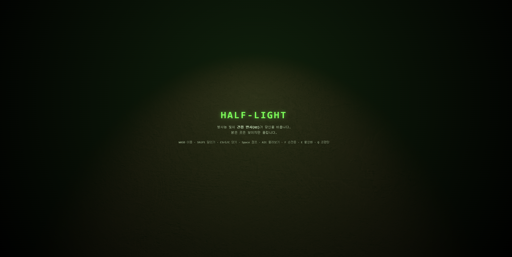

타이틀 화면. 초록빛 비네팅과 스캔라인으로 방사능 시설의 분위기를 표현했다. 하단에 조작키 안내가 있다.

### 1.2 핵심 메커니즘 — 빛과 그림자의 딜레마
- **목표:** 흩어진 **단말기 5개를 모두 활성화** → 출구 개방 → 탈출
- **위협 1 (좀비):** 시야(FOV)·소리·빛으로 플레이어를 감지, 접촉 시 사망
- **위협 2 (방사능):** 시간에 따라 피폭이 누적, 100% 도달 시 사망 → 사실상 제한시간
- **자원:** 손전등(시야 확보 ↔ 노출 증가), 조명탄(미끼), 스태미나(달리기), 앉기/점프

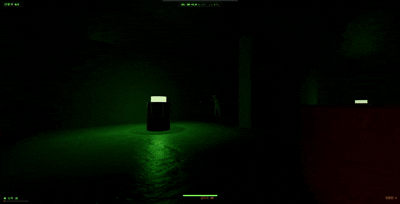

밝은 곳(단말기 근처)에 서면 잘 보이지만 **노출도(감지도)** 가 올라가고, 어둠 속으로 물러나면 안전하지만 시야가 좁아진다.
이 **트레이드오프**가 HUD의 *감지도(노출)* 게이지로 즉시 피드백된다. (손전등 `F` 도 같은 딜레마 — 켜면 보이지만 노출↑)

### 1.3 승패 화면
| 탈출 성공 | 발각 사망 | 피폭 사망 |
|---|---|---|
| 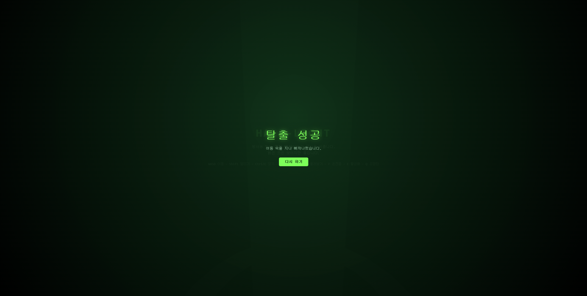 | 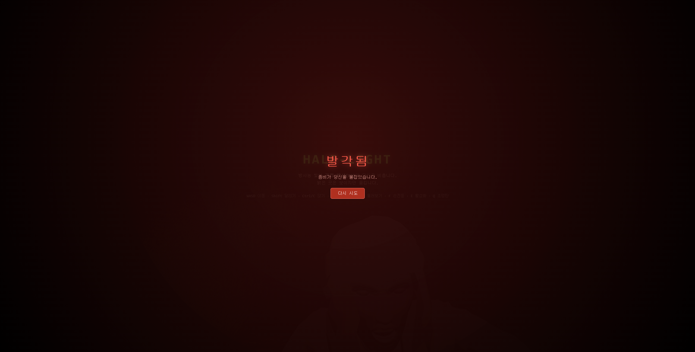 | 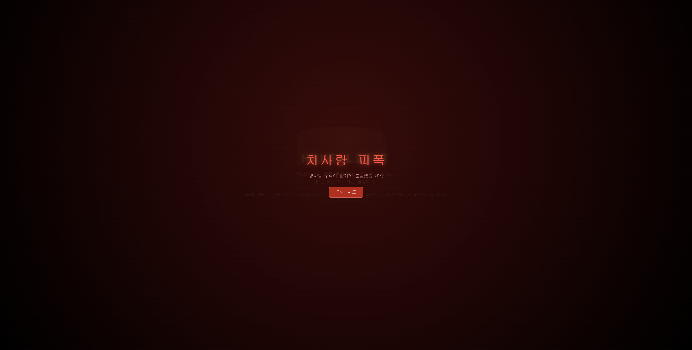 |

단말기 5개를 모두 켜고 출구로 빠져나오면 "탈출 성공"(초록), 좀비에게 잡히면 "발각됨"(붉은 화면 + 좀비 실루엣), 피폭 100%면 "치사량 피폭"으로 게임오버.

---

## 2. 변환과 그래픽스 파이프라인 (L1, L2, L3)

### 2.1 카메라 / View·Projection Transform
강의의 렌더링 변환 파이프라인 **Model→World→View→Projection→Screen** 을 그대로 사용한다.
1인칭 원근 카메라(`PerspectiveCamera`)가 **View 변환**(카메라 기준 좌표계)과 **원근 투영(Projection)** 을 담당한다.
멀리 있는 복도와 단말기가 원근에 따라 작아지는 것이 투영 변환의 결과다.

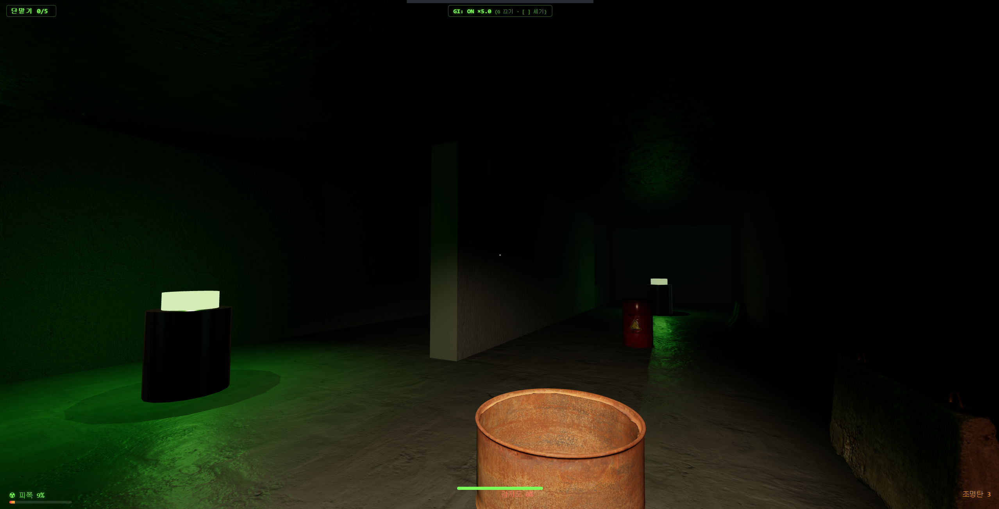

### 2.2 Scene Graph / World Transform
좀비·단말기·소품·벽이 각자 **위치(Location)·회전(Rotation)·스케일(Scaling)** 을 가진 노드로 씬 그래프에 배치된다.
특히 좀비는 **골격(부모-자식 본 계층)** 으로 World/Local 변환이 중첩되는 대표 사례다(5장 참조).


복도에 기둥·단말기·좀비가 각각 다른 변환으로 배치되어 하나의 씬 그래프를 이룬다.

### 2.3 자유 시점 (View Transform 응용)
`Alt` 키를 누르면 **이동 방향은 고정한 채 카메라(뷰 행렬)만 회전**한다(배틀그라운드식 둘러보기).
이동 기준 벡터와 시선 벡터를 분리해 구현했다 — View 변환을 이동 로직과 독립적으로 다루는 예다(코드: `player.js`의 `enterFreeLook`).

### 2.4 래스터화 파이프라인
본 게임은 WebGL의 **Vertex→Rasterizer→Fragment** 래스터화 파이프라인 위에서 동작한다.
뒤에 나오는 GI도 레이트레이싱이 아니라 **이 래스터화 파이프라인으로 장면을 캡처**해 구현했다(4장 참조).

---

## 3. 조명과 셰이딩 (L4)

### 3.1 직접광 — PBR / emissive / 그림자
강의의 **렌더링 방정식·Phong(ambient+diffuse+specular)·광원 종류·emissive material** 을 사용한다.
방사능 단말기는 **emissive(자체 발광) 재질 + PointLight** 로 빛의 근원이 되고, 그 빛이 바닥에 원형 풀과 그림자를 만든다.

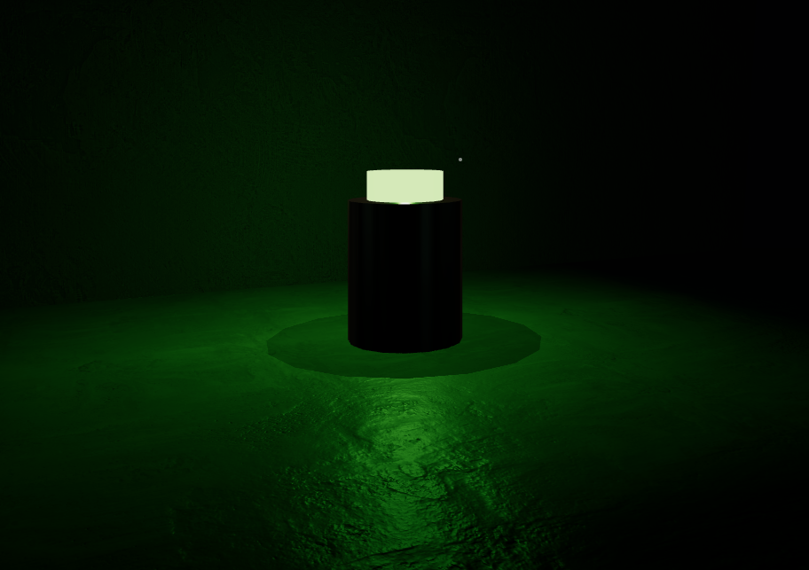

단말기 상단이 스스로 빛나는(emissive) 광원이며, 그 아래 바닥에 빛의 원형 풀이 생긴다.

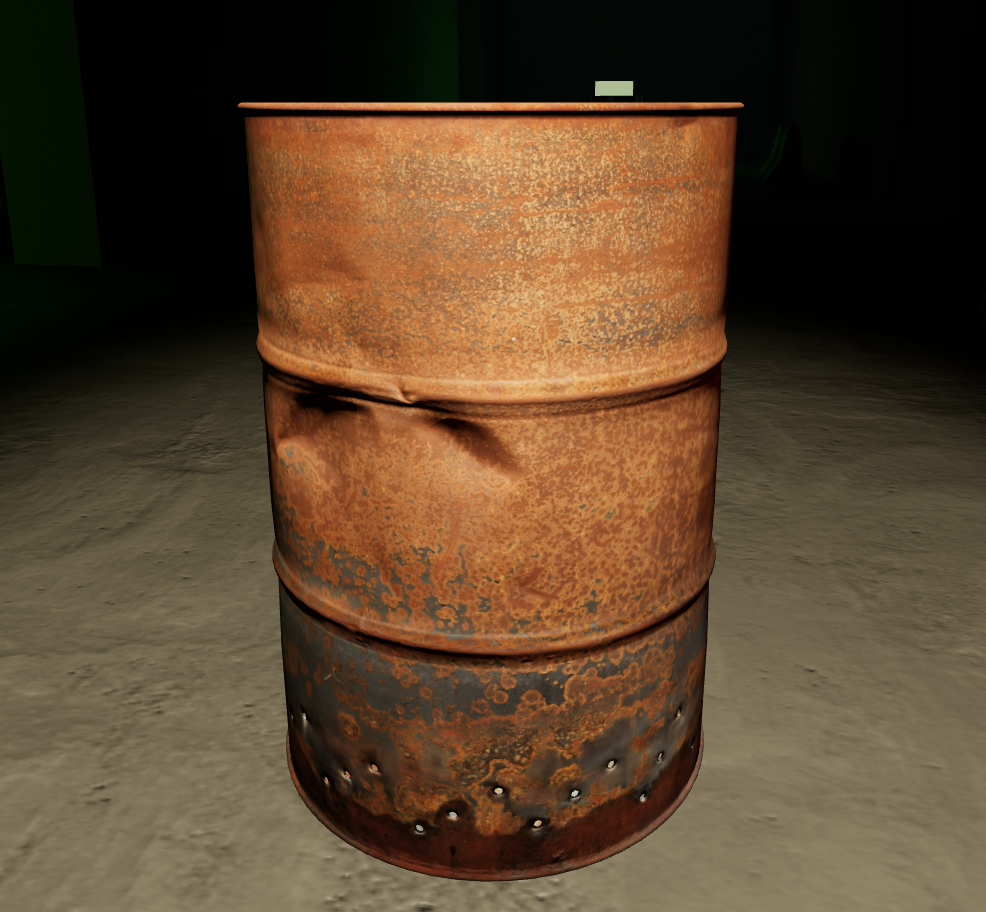

금속 드럼통 표면의 하이라이트와 반사 — PBR `MeshStandardMaterial`의 metalness/roughness와 환경맵(PMREM)으로 표현. (텍스처는 4장 참조)

### 3.2 ★ Global Illumination — DDGI (probe GI) ★ — 본 과제의 핵심 기법
직접광만으로는 빛이 직접 닿는 곳만 보이고 그 외에는 새까맣다.
**간접광(바운스 라이트)** 을 더해야 단말기의 초록빛이 벽·바닥·천장에 **번지고(color bleeding)** 그늘이 은은하게 차오른다.

#### GI ON / OFF 비교 (같은 위치)
| GI ON | GI OFF |
|---|---|
| 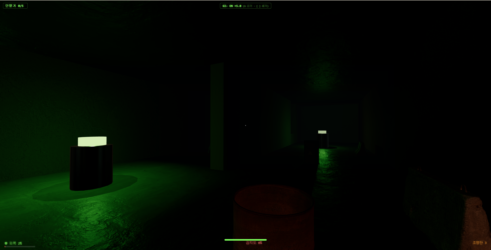 | 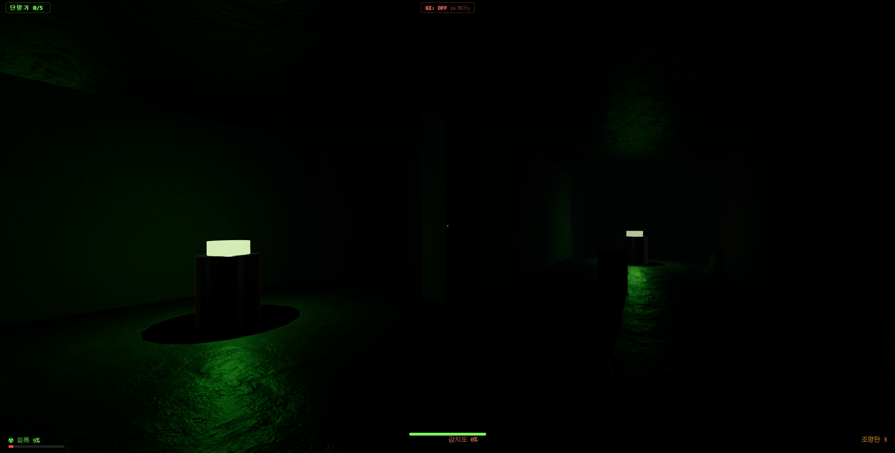 |

게임 내 `G` 키로 즉시 토글한 **같은 지점**이다.
- **GI ON:** 단말기의 초록빛이 왼쪽 벽과 바닥, 멀리 복도 벽까지 **간접적으로 번져** 공간 전체가 은은하게 드러난다.
- **GI OFF:** 단말기 바로 아래 직접광 풀만 남고, 빛이 직접 닿지 않는 벽·바닥은 **새까맣게** 죽는다. 색 번짐이 사라진다.

아래는 실제 게임에서 `G`로 GI를 켜고 끄는 **실시간 토글 영상**이다(같은 화면에서 밝기/색 번짐이 출렁이는 것을 확인):

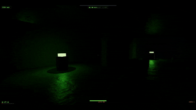

#### 구현 방식 (DDGI 매핑)
WebGL에는 하드웨어 레이트레이싱이 없으므로, 원본 DDGI의 절차를 **래스터화로 치환**해 구현했다.
- **probe 격자(7×2×7)** 를 공간에 고르게 배치 — DDGI의 *"fixed 3D probe grid"*.
- 각 probe에서 **`CubeCamera`로 6면을 래스터화 캡처** → 방향별 입사 radiance(ambient-cube)로 저장.
  → 원본 DDGI의 *"각 probe에서 ray 발사"* 를 **6면 큐브 렌더로 대체**(레이트레이싱 불필요).
- **멀티바운스(3패스):** 이전 패스의 결과를 다음 패스 입력으로 다시 먹여 무한 바운스를 근사(recursive feedback).
- 픽셀 셰이더(`onBeforeCompile` 주입)에서 **인접 8개 probe를 트라이리니어 블렌딩** → 표면 법선 방향의 irradiance를 `indirectDiffuse`에 합산.
- 동일한 probe 데이터를 **CPU에서도 샘플링**해 "현재 위치의 밝기" = *노출도* 를 계산, 좀비 감지 로직에 사용(기획과 기술의 연결).
- *자세한 기술 노트: `docs/design-notes.md`*

---

## 4. 텍스처 (L5)

### 4.1 텍스처 매핑 — albedo / normal / roughness (PBR)
강의의 **Texture Mapping·UV·Normal map·Roughness** 를 적용했다.
벽은 갈라진 석고/콘크리트, 바닥은 콘크리트로 **albedo + normal map + roughness map**(ambientCG, CC0)을 입혀 PBR 음영을 낸다.
`RepeatWrapping` 타일링과 anisotropic filtering으로 넓은 면에서도 디테일이 유지된다.

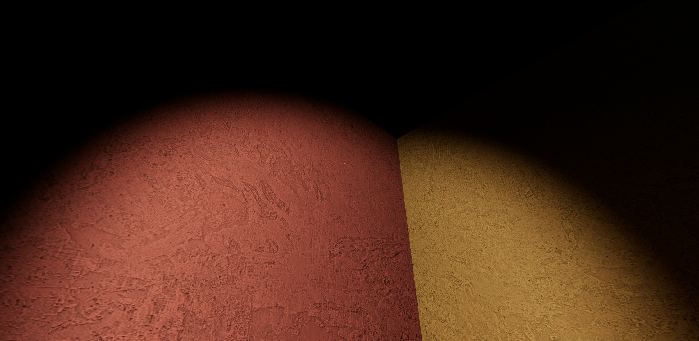

손전등을 가까이 비춘 벽 — normal map 덕분에 평평한 면이 **요철처럼 음영**진다. (좌우 벽이 붉은/노란 색조인 것은 GI color bleeding을 강조하기 위한 벽 틴트다.)

### 4.2 외부 3D 모델 + 텍스처 (정적 소품)
Poly Haven(CC0)의 **텍스처가 입혀진 glTF 소품**(드럼통·공구함·도로 바리어·콘크리트 잔해 등)을 로드하고, 각 소품에 **AABB 충돌**을 부여했다.

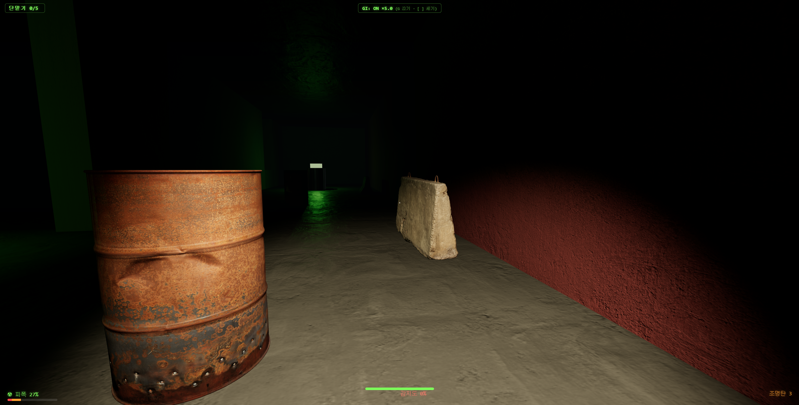

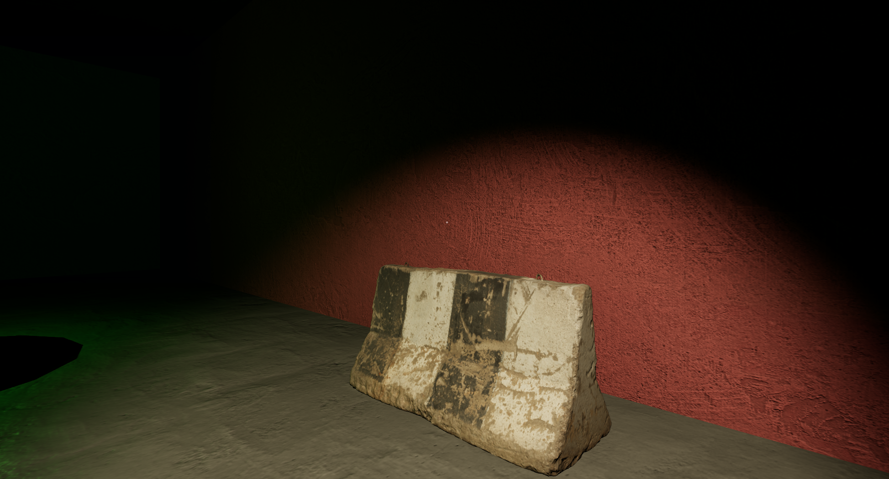
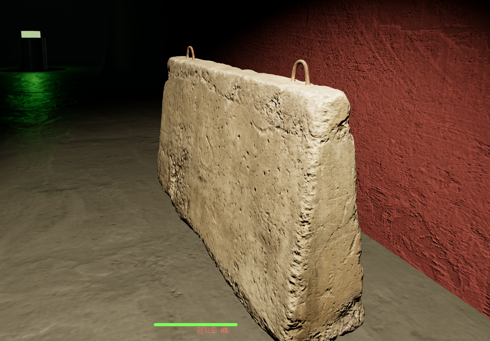

### 4.3 환경맵 (Environment Map / Reflection)
금속 드럼통 등 매끈한 금속 재질에 **equirectangular 환경맵(PMREM)** 을 적용해 주변광 반사를 표현했다(3.1의 specular 하이라이트와 함께).


---

## 5. 스켈레톤과 애니메이션 (L6)

### 5.1 스킨드 메쉬 + 스켈레톤 애니메이션
강의의 **Skeleton·Joint/Bone·Skinned Mesh·FK·애니메이션** 을 적용했다.
Mixamo 좀비(스킨드 메쉬)를 **FBX로 로드**하고 `AnimationMixer`로 **Idle/Walk/Run/Turn/Scream/Agonize** 클립을 재생한다.
두 좀비는 외형이 다르지만 **공용 Mixamo 스켈레톤**을 공유하므로 같은 애니메이션 클립을 호환해 쓴다.

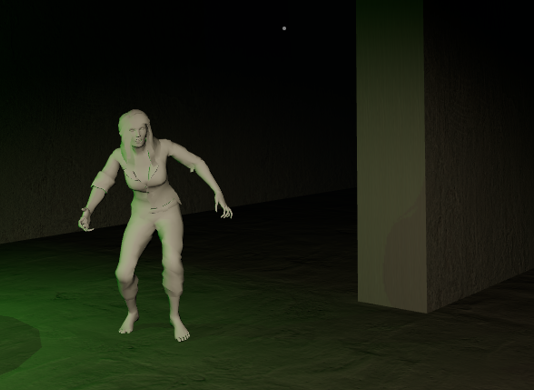
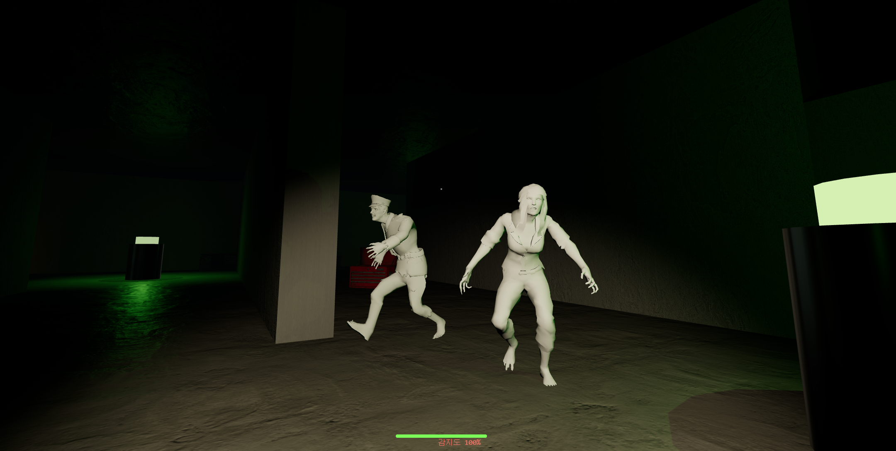

### 5.2 상태 기반 애니메이션 전환 / 리액션
AI 상태(**배회 → 수색 → 추격**)에 따라 애니메이션이 전환된다. 추가로 이벤트성 **리액션**을 `LoopOnce` 로 재생 후 원래 상태로 복귀한다:
- 플레이어를 **처음 발각**하면 비명(**Scream**) → 추격 시작
- **조명탄**(미끼)을 인지하면 괴로워하는 모션(**Agonize**)으로 그 자리에 묶임
- 방향 전환 시 **Turn** 모션으로 부드럽게 회전(`TURN_SPEED` 보간)


조명탄을 던지면 좀비가 그쪽으로 다가가 **괴로워하는(Agonize) 리액션**을 재생하는 모습(미끼에 묶임):

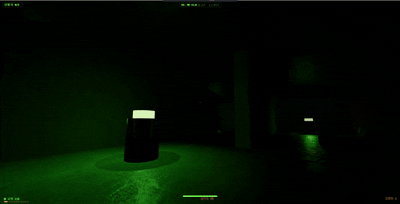

---

## 6. 게임 메커니즘 상세 (완성도)

### 6.1 감지(Stealth) 시스템
좀비 감지는 **시야각(FOV) + 거리 + 가시선(LOS 레이캐스트) + 소리(자세별 청취 거리) + 손전등 빔** 을 종합한다.
- **노출도(밝기)** 가 높을수록 더 멀리서 보인다: `sightRange = SIGHT_MIN + (SIGHT_MAX−SIGHT_MIN)·(노출/100)`.
- 벽에 가리면 시야는 차단(LOS)되지만 **소리는 벽 너머로도** 전달된다.
- HUD의 *감지도* 는 실제 좀비가 플레이어를 인지한 정도(awareness)를 표시한다.


### 6.2 길찾기 AI (A*)
좀비는 점유 격자 위에서 **A\* 길찾기**(octile heuristic)로 벽/장애물을 우회한다.
2마리가 **동시에** 플레이어를 감지하면 좌우로 갈라져 **협공(flanking)** 하고, 경로가 벽 뒤로 빠지지 않도록 `nav.isFree` + LOS로 검증한다. 좀비끼리는 **분리(separation)** 로 겹침을 막는다.


### 6.3 조명탄 (미끼)
`Q` 로 **조명탄**을 던지면, 바닥에서 빛나는 조명탄이 주변 좀비를 **유인**한다. 좀비는 그쪽으로 다가가 괴로워하며(Agonize) 그 자리에 묶이고, 그 틈에 플레이어는 잠입한다.


### 6.4 목표 — 단말기 활성화
`E` 로 단말기를 활성화한다. 활성화 순간 **큰 소리**가 나 주변 좀비를 유인하는 리스크가 있다. 5개를 모두 켜면 출구가 열린다.

| 활성화 전 ([E] 안내) | 활성화 후 (청록으로 전환) |
|---|---|
| 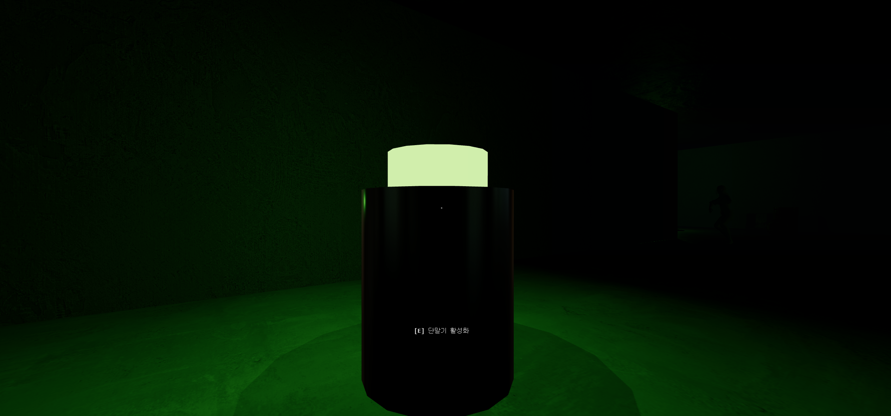 | 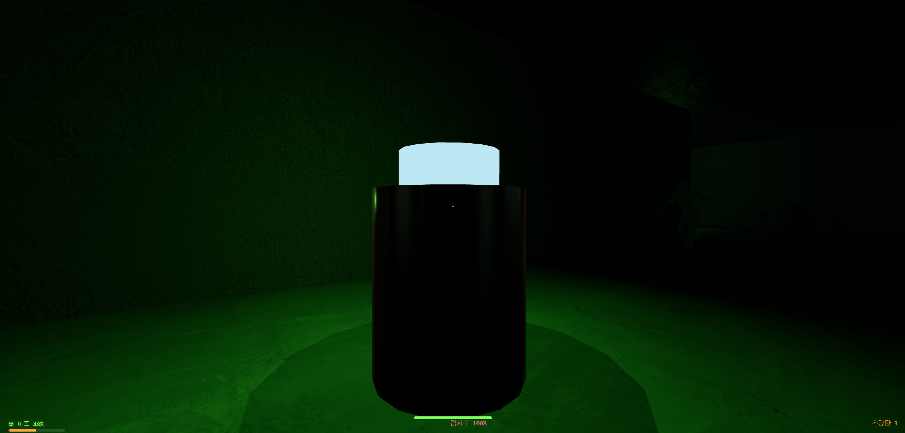 |

활성화되면 단말기 상단 발광색이 **초록 → 청록**으로 바뀌고 목표 카운터가 증가한다.

### 6.5 레벨 디자인 — 미로 + 특수 통로 (플레이어 전용 지름길)
맵은 미로형이며, **플레이어만 통과할 수 있는 지름길**이 두 종류 있다(좀비는 못 지나감) — 추격을 따돌리는 데 쓴다.

| 개구멍 — 앉아서 기어가기 | 잔해 — 점프해서 넘기 |
|---|---|
| 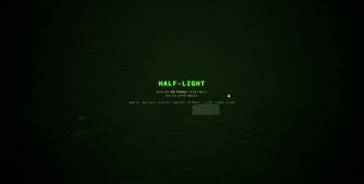 | 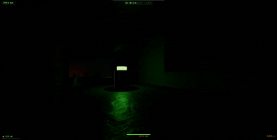 |

- **개구멍:** 천장이 낮은 구멍은 `C`로 **앉아야** 통과(서 있으면 막힘). 좁은 통로 안에서는 강제로 앉은 자세가 유지된다.
- **점프 발판:** 낮은 잔해는 `Space`로 **점프해 올라타** 넘는다. 발 높이가 잔해 윗면보다 낮으면 측면에 막히고, 올라서면 통과한다(렛지 유예로 끼임 방지).

### 6.6 emissive 광원과 어둠
방사능 단말기는 어둠 속에서 유일한 길잡이이자, 동시에 플레이어를 비춰 **노출**시키는 양날의 검이다.

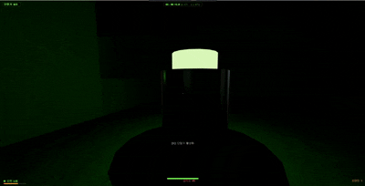

### 6.7 사운드
**Web Audio API로 절차적 생성**(외부 음원 파일 없음) — 앰비언트 드론, 자세별 발소리, 감지 시 심박음, 추격 시 BGM 레이어 전환, 조명탄/단말기 효과음.

### 6.8 전체 플레이 데모
아래는 실제 플레이 영상(GIF)이다 — 이동/조명탄/단말기/좀비 거동을 한 번에 확인할 수 있다.

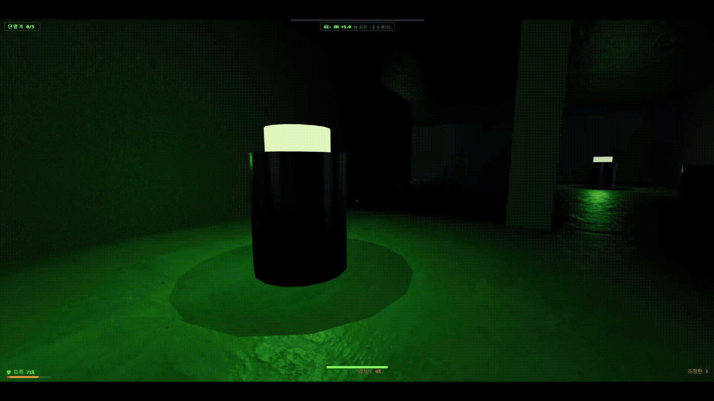

---

## 7. 사용 에셋 / 라이선스
- **좀비:** Mixamo (Adobe, 무료) — 캐릭터 + 모션 클립
- **정적 소품:** Poly Haven (CC0) — 드럼통, 공구함, 도로 바리어, 콘크리트 잔해 등
- **텍스처:** ambientCG (CC0) — 콘크리트, 석고, 금속
- **사운드:** Web Audio API 절차적 생성 (외부 에셋 없음)
- **엔진/라이브러리:** Three.js

## 8. 빌드 / 실행
```bash
npm install
npm run dev      # 로컬 개발 서버
npm run build    # dist/ 빌드 (GitHub Pages 배포본)
```

- 배포: `dist/` 를 `gh-pages` 브랜치로 올려 GitHub Pages로 서비스.
- 기술 설계 근거(충돌을 BVH 대신 AABB로 한 이유, A\* 내비, WebGL에서 RT 없이 GI 구현 등): **`docs/design-notes.md`**.
